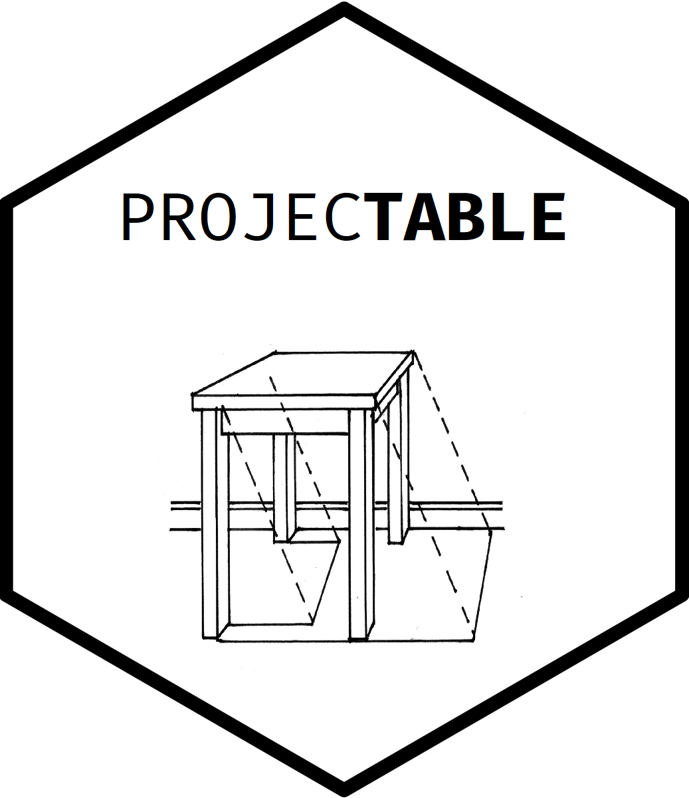
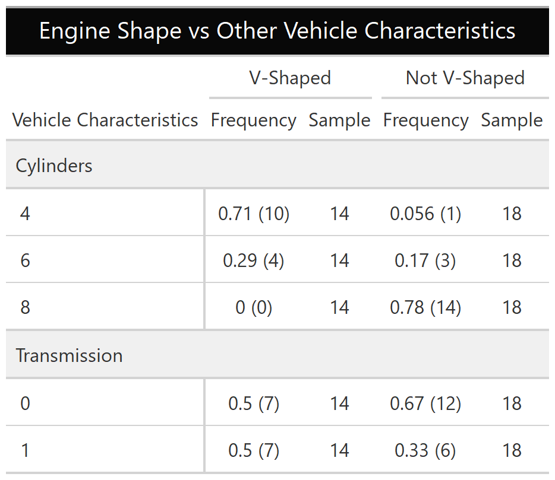
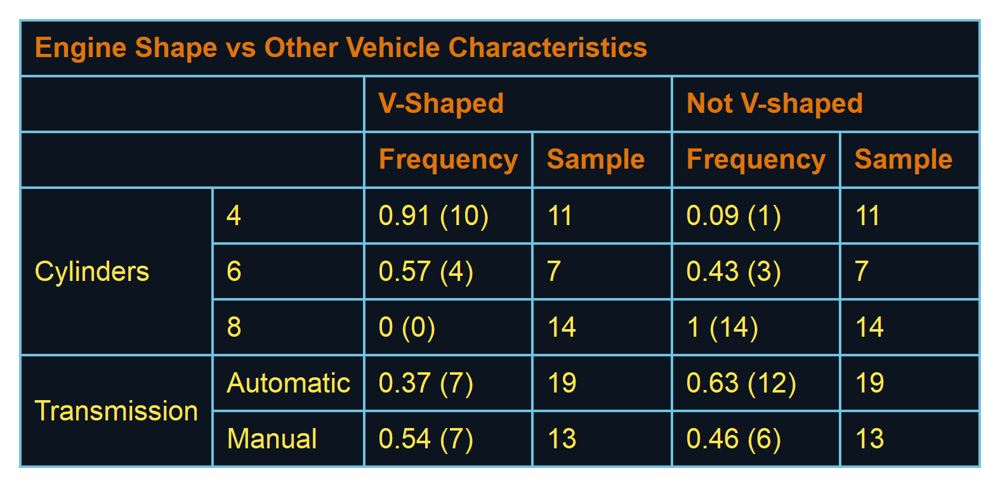

<!-- README.md is generated from README.Rmd. Please edit that file -->

```{r, include = FALSE}
knitr::opts_chunk$set(
  collapse = TRUE,
  comment = "#>",
  fig.path = "man/figures/README-",
  out.width = "100%"
)

```

<!-- badges: start -->
[](https://www.tidyverse.org/lifecycle/#experimental)
[](https://github.com/socialresearchcentre/projectable/actions)
<!-- badges: end -->

# projectable <a href='https://github.com/socialresearchcentre/projectable'></a>

Producing output tables is an exceedingly manual activity, particularly when
tabling complex statistics with associated metadata. When preparing large
numbers of tables for presentation or publication, providing different views of
the same result set can require large amounts of re-processing and fiddly manual
combination and reshaping of outputs.

Inspired by the `gt` R package (https://gt.rstudio.com/), `projectable` is
designed to easily support flexible specification and table manipulation. The
`projectable` approach treats a table as a collection of calculations with
accompanying metadata rather than simple values. It aims to support easily
moving from specification to data production to presentation of results by
treating an output table as a “projection” of complex results.

## Installation

You can install the unreleased version of projectable from
[GitHub](https://github.com/) with:

``` r
devtools::install_github("socialresearchcentre/projectable")
```

## Usage

The `projectable` package implements a set of interlocking functions which are
designed to ingest a simple dataframe, perform calculations upon it to 
generate a metadata-rich table like object, and reshape that object back into
a 'flat' dataframe to be formatted using `gt` or `flextable`.


```{r my_tbl, include = TRUE, message = FALSE, warning = FALSE}
library(projectable)
library(dplyr)
library(gt)
library(flextable)

my_tbl <- mtcars %>%
  # Create metadata-rich summary table according to a column and row specification
  prj_tbl_rows(
    Cylinders = cyl,
    Transmission = list(Automatic = am %in% 0, Manual = am %in% 1),
  ) %>% 
  prj_tbl_cols(
    `V-Shaped` = col_freq(n = vs %in% 1, N = vs %in% 0:1),
    `Not V-shaped` = col_freq(n = vs %in% 0, N = vs %in% 0:1)
  ) %>%
  prj_tbl_summarise() %>% 
  # Tag columns to display
  prj_shadow(everything(), .shadow = c(Frequency = "{signif(p, 2)} ({n})", Sample = "{N}")) 


my_gt <- my_tbl %>% 
  # Pass through to `gt` for formatting
  prj_gt() %>% 
  gt::tab_header(title = "Engine Shape vs Other Vehicle Characteristics") %>% 
  gt::tab_stubhead(label = "Vehicle Characteristics") %>% 
  gt::tab_options(
    heading.background.color = "#080808",
    row_group.background.color = "#f0f0f0"
  )
```

```{r out.width = "75%", echo = FALSE, fig.align = "center"}
if (pkgdown::in_pkgdown()) {
  # For website
  my_tbl
} else {
  # For GitHub
  
} 
```

```{r}
my_flex <- my_tbl %>% 
  # Pass through to `flextable` for formatting
  prj_flex() %>% 
  flextable::theme_tron_legacy() %>%
  flextable::add_header_lines("Engine Shape vs Other Vehicle Characteristics")
```
```{r out.width = "75%", echo = FALSE, fig.align = "center"}

```
