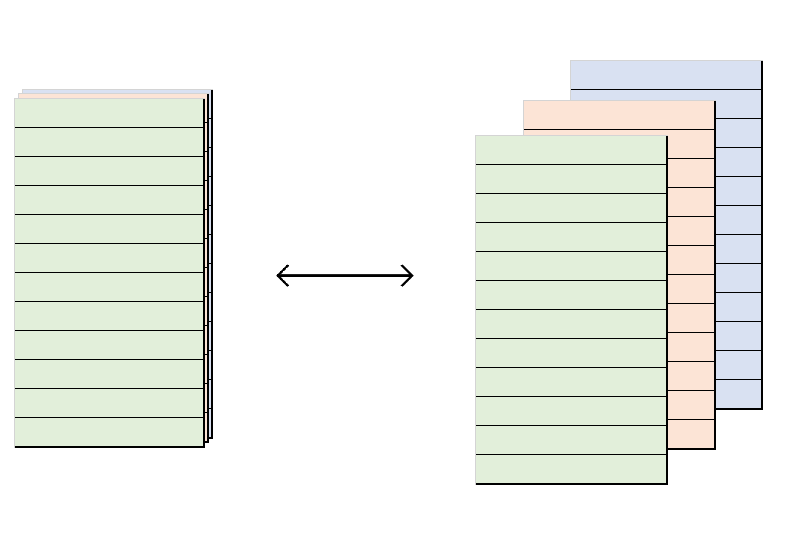
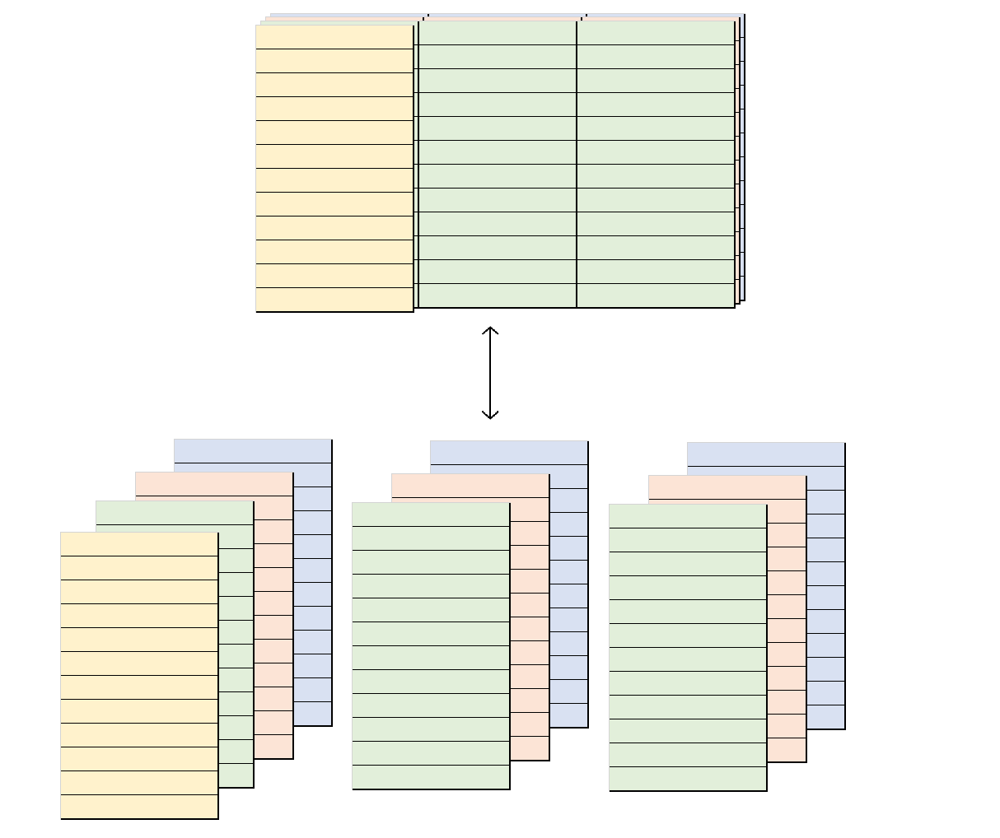
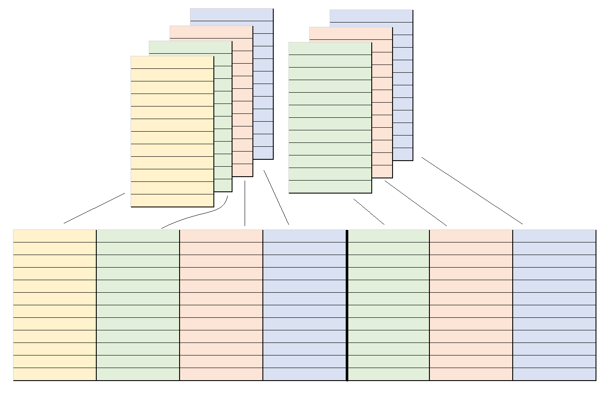

```{r, include = FALSE}
knitr::opts_chunk$set(
  collapse = TRUE,
  comment = "#>"
)
```


When producing summary tables, it is very common to include multiple columns 
which relay the same (or very similar) information in different formats. Take,
for instance, a simple frequency cross-tabulation: one will very often include
not only the (row, column or cell) proportion but the raw and/or base counts 
too. Thus, one might do something like this:

```{r}
# Proportions on their own
mytab <- table(mtcars$am, mtcars$cyl)
ftable(signif(prop.table(mytab, 2), 2)) 

# Proportions along with the raw counts
mytab[1:length(mytab)] <- paste0(
  signif(prop.table(mytab, 2), 2), 
  " (", mytab, ")"
)
ftable(mytab)  
```

It makes sense to think of a table like the second one above as displaying a primary
statistic (a proportion) along with ancillary metadata (a raw count). This is,
fundamentally, how `projectable` approaches summary tables in general. In the
world of `projectable`, there is a very tight relationship between a summary 
table which shows proportions only and one which shows proportions along with 
raw and/or base counts: they are **projections** of one and the same metadata-rich
table-like object. What follows is intended to explain what that means. 

## The `projectable_col` class

At the ground level, `projectable` implements a range of `projectable_col` 
vectors which each store a primary statistic (like a proportion) alongside 
supplementary pieces of metadata (like raw and base counts). These are the 
building blocks for summary tables. 

To create a `projectable_col`, we use the `col_*()` functions like `col_freq()`:

```{r}
library(projectable)
x <- col_freq(n = rep(1, 5), N = c(1:5), summarised = TRUE) 
x
```

Although superficially one dimensional, these vectors can be thought of as 
having two dimensions: length and depth. Running down their length, we pass
through statistics corresponding to different objects (e.g. different aggregates
of an underlying dataset); running along their depth, we pass through different
pieces of data related to the one primary statistic for a given object.

Thus, the `col_freq` above has a length of 5: it stores the frequency of 5 
different things. But it also holds 3 different pieces of data for each 
entry: a `p`, an `n` and an `N`. 

```{r echo=FALSE, out.width = "50%", fig.align='center'}

```

The hidden dimensionality of a `projectable_col` becomes obvious when we 
'flatten it out' by turning it into a dataframe that is as wide as the 
`projectable_col` is deep:

```{r}
out <- prj_project_col(x)
knitr::kable(out)
```

## Metadata-rich tables

When we combine multiple `projectable_col` vectors, we get an object that can 
be thought of as occupying three dimensions: it has rows, columns, and depth.
Behind the face value of each of its `projectable_col` columns are additional
pieces of metadata.

```{r echo=FALSE, out.width = "50%", fig.align='center'}

```

And, just as we could 'flatten' a single `projectable_col` out into a dataframe,
we can 'flatten' a dataframe that is made up of `projectable_col` vectors 
out into a wider dataframe made up of ordinary vectors. 

```{r echo=FALSE, out.width = "50%", fig.align='center'}

```

We just need to stipulate how to map the elements of each `projectable_col` onto 
the columns of the output dataframe:

```{r}
# Create a `col_binomial` of length 5
b_trials <- lapply(1:5, function(x) stats::rbinom(1000, 1, 1/x))
n_successes <- vapply(b_trials, function(x) sum(x), integer(1))
n_sample <- vapply(b_trials, length, integer(1))
y <- col_binomial(n_successes, n_sample, summarised = TRUE)

# Combine it with the `col_freq` from earlier:
my_tbl <- data.frame(my_freq = x, my_binomial = y)

out <- prj_project(my_tbl, list(
  # Map the proportion of `my_freq` onto a `my_freq.proportion` column, 
  # and the counts onto a `my_freq.counts` column:
  my_freq = c(proportion = "{signif(p, 2)}", counts = "{n} / {N}"), 
  # Map the probability of `my_binomial` onto a `my_binomial.probability` column, 
  # and the confidence interval onto a `my_binomial.ci` column:
  my_binomial = c(probability = "{signif(p, 2)}", ci = "{signif(ci_lower, 2)}-{signif(ci_upper, 2)}") 
))

knitr::kable(out)
```


What we're doing here -- mapping a quasi-three-dimensional object onto a 
two-dimensional one -- is very similar to the mathematical operation of 
**projection**. We can think of the dataframe produced by `prj_project()` as
being the **shadow** of the metadata-rich object passed into that function.

Coming full circle, we can now understand what it means for the two tables we
started with to be projections of the same underlying object:

```{r message = FALSE, warning = FALSE}
library(dplyr)

cols <- glue::glue("col_freq(cyl %in% {c(4, 6, 8)}, cyl %in% 4:8)")
cols <- rlang::parse_exprs(cols) %>% rlang::set_names(paste(c(4, 6, 8), "Cylinders"))

prjtbl <- mtcars %>% 
  prj_tbl_cols(!!!cols) %>% 
  prj_tbl_rows(Transmission = am) %>% 
  prj_tbl_summarise()

# Proportions on their own
out <- prjtbl %>% 
  prj_shadow(everything(), .shadow = "{signif(p, 2)}") %>% 
  prj_project()

knitr::kable(out)

# Proportions along with raw counts
out <- prjtbl %>% 
  prj_shadow(everything(), .shadow = "{signif(p, 2)} ({n})") %>% 
  prj_project()


knitr::kable(out)
```


